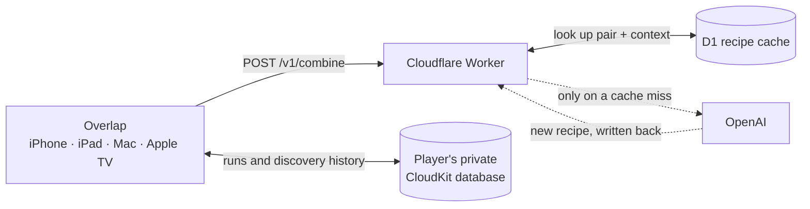

# Overlap

**What can two things become?**

Overlap is a single-player crafting game for iPhone, iPad, Mac, and Apple TV. You
start with four elements — Water, Fire, Wind, and Earth — and combine pairs to
discover new ones. When nobody has tried a pair before, a small Cloudflare Worker
invents the result and remembers it, so the next player who tries that pair gets
the same answer.


## Platforms

One SwiftUI codebase and one shared model layer, with the input model chosen per
idiom rather than lowest common denominator.

| Platform | Minimum OS | How you combine |
| --- | --- | --- |
| iPhone | iOS 26 | Drag one pill onto another; the tray sits underneath as a shelf |
| iPad | iPadOS 26 | Drag, with the tray in a leading sidebar |
| Mac | macOS 26 | The same board and sidebar in a window, driven by a pointer |
| Apple TV | tvOS 26 | Focus a tile and select, twice. Dark only |

iPhone and iPad share a single target: the model layer is identical and only the
layout responds to size class.

## How it works

The app knows the four starting elements and nothing else. Every combination is
resolved through a shared recipe service, so a recipe correction reaches every
player without shipping a build.



Three rules shape the data model:

- **A recipe is permanent.** Once a pair resolves in a given context, that result
  never changes. Improving the generation prompt must not restyle something a
  player already discovered.
- **Identity is `input A + input B + context`,** with input order normalized and
  names compared as NFC-normalized lowercase. `Fire + Water` and `water + fire`
  are one recipe.
- **An element owns its own name and emoji,** separately from the recipes that
  produce it, so Steam looks the same however you got there.

A run may carry a **context** — the explicit default `none`, or a theme such as
`Minecraft` — which becomes part of the recipe identity. The same two ingredients
can therefore give a different, fitting result in a different world. Context is
fixed when a run is created; changing it means starting a new run.

## Project status

The game is functionally complete and runs on all four platforms. Two things are
outstanding:

- **Visual design pass.** The interface is built to the functional spec and uses
  functional labels throughout. Layout, motion, and typography have not had a
  dedicated design pass.
- **Device validation for sync.** A signed Mac build syncs correctly against
  private CloudKit, and concurrent merge tests pass. Handoff between physical
  iPhone, iPad, and Apple TV hardware still needs testing.

See [`roadmap/ROADMAP.md`](roadmap/ROADMAP.md) for the phase-by-phase status and
[`roadmap/IMPLEMENTATION.md`](roadmap/IMPLEMENTATION.md) for build, sync, and
deployment notes.

## Getting started

### Prerequisites

- Xcode with the macOS 26, iOS 26, and tvOS 26 SDKs
- [XcodeGen](https://github.com/yonaskolb/XcodeGen) — `brew install xcodegen`
- Node.js 20+ and a Cloudflare account, to run your own Worker

`project.yml` is the source of truth for the Xcode project. Generate it before
the first build, and again after adding or moving any Swift file:

```bash
xcodegen generate
```

### Local configuration

Nothing account-specific is committed to this repository — no Apple Developer
Team ID and no service endpoint. A fork therefore builds without inheriting
anyone else's account, and cannot call anyone else's Worker.

Both values live in one Git-ignored file. Create it from the template:

```bash
cp Config/Overlap.local.xcconfig.example Config/Overlap.local.xcconfig
```

| Setting | What to put there |
| --- | --- |
| `DEVELOPMENT_TEAM` | Your Apple Developer Team ID, from developer.apple.com under Membership. Required to sign the app, and therefore required for iCloud sync |
| `COMBO_FALLBACK_ENDPOINT` | The HTTPS URL of your deployed Worker, ending in `/v1/combine`. Fill this in after [deploying one](#deploy-your-own-worker) |

Then regenerate the project:

```bash
xcodegen generate
```

> In an `.xcconfig` value, `//` starts a comment, which would silently truncate
> a URL. Write it as
> `https:/$()/your-worker.your-account.workers.dev/v1/combine`.

`Config/Overlap.xcconfig` declares both settings as empty and pulls in your
local file with `#include?`, so the project still generates and builds when the
override is absent. Without an endpoint the app runs but cannot resolve new
combinations; without a team ID you can only build unsigned, which means passing
`OVERLAP_CLOUD_SYNC_ENABLED=NO`.

### Run the Mac app

```bash
xcodegen generate
./script/build_and_run.sh
```

The script builds the `Overlap-macOS` scheme into `build/local/` and opens the
app. It accepts `--debug`, `--logs`, `--telemetry`, and `--verify`.

For the other platforms, open `Overlap.xcodeproj` and select `Overlap-iOS` or
`Overlap-tvOS`.

Cloud sync requires a signed build. Unsigned local builds must pass
`OVERLAP_CLOUD_SYNC_ENABLED=NO`.

### Deploy your own Worker

```bash
cd worker
npm ci
npx wrangler login
npx wrangler d1 create overlap-recipes
npx wrangler secret put OPENAI_API_KEY
npx wrangler d1 migrations apply overlap-recipes --remote
npm run deploy
```

Replace `database_id` in `worker/wrangler.jsonc` with the ID that
`d1 create` prints.

To preload this repository's seed recipes, run `npm run seed:sql` and execute the
generated file:

```bash
npx wrangler d1 execute overlap-recipes --remote --file=/private/tmp/overlap-recipes-seed.sql
```

After that, new recipes are added automatically on cache misses.

The Worker exposes two routes:

| Route | Purpose |
| --- | --- |
| `GET /health` | Liveness check |
| `POST /v1/combine` | `{ "left": "Water", "right": "Fire", "context": "Minecraft" }` — an omitted context means `none` |

Other useful scripts: `npm test` (service tests), `npm run check` (type check),
and `npm run deploy:dry-run`.

Before exposing a Worker publicly, add a Cloudflare rate-limit rule for
`POST /v1/combine`. OpenAI project limits cap spend, but rate limiting is what
protects the endpoint itself.

Once it is deployed, put the Worker's URL in `COMBO_FALLBACK_ENDPOINT` in
`Config/Overlap.local.xcconfig` and run `xcodegen generate` again. That value
becomes the `ComboFallbackEndpoint` Info.plist entry on every target.

## Keys and privacy

**The Worker owns the OpenAI credential.** Keep `OPENAI_API_KEY` solely in
Cloudflare's encrypted Worker secrets. It does not belong in an Xcode build
setting, a source file, a committed `.env`, or the app bundle. The app has never
held it and has no way to use it.

What leaves the device, and what does not:

- A combination request carries **only the two element names and the context**.
- Discovered recipes and history are kept on device, and runs sync through the
  **player's own private CloudKit database** — not through this project's
  infrastructure.
- No account data or discovery history is ever sent to the Worker.
- Because the Worker checks D1 first, an OpenAI request happens only for a pair
  and context nobody has tried yet.

## Repository layout

| Path | Contents |
| --- | --- |
| `Overlap/Shared/` | Game model, views, and design tokens shared by every platform |
| `Overlap/iOS`, `macOS`, `tvOS` | Per-platform app entry points |
| `Overlap/Resources/` | Asset catalogs |
| `Config/` | Info.plists, entitlements, and the build configuration xcconfig |
| `worker/` | Cloudflare Worker, D1 migrations, seed and control scripts, tests |
| `Tests/` | Client and model unit tests |
| `combos.json` | The seed recipe corpus, loaded into D1 by the seed script. Not bundled into the app |
| `craft_state.py` | The generator that built the seed corpus |
| `docs/`, `roadmap/` | Technical write-ups and the functional roadmap |
| `script/` | Build and run helper |

## License

Released under the [MIT License](LICENSE).
